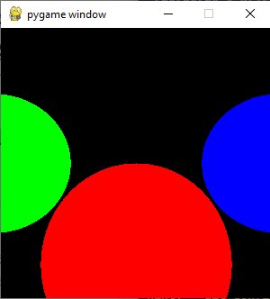

# Raytracer

As presented in Gabriel Gambetta's computer graphics book. 

Implemented in Python, using Pygame to handle the actual drawing of pixels to the screen.

## Running

I'm developing this in WSL, therefore `make` runs it in the Windows host from within WSL. (Mostly it's just a lazy hack so I can run it from Vim via `:make`.)

